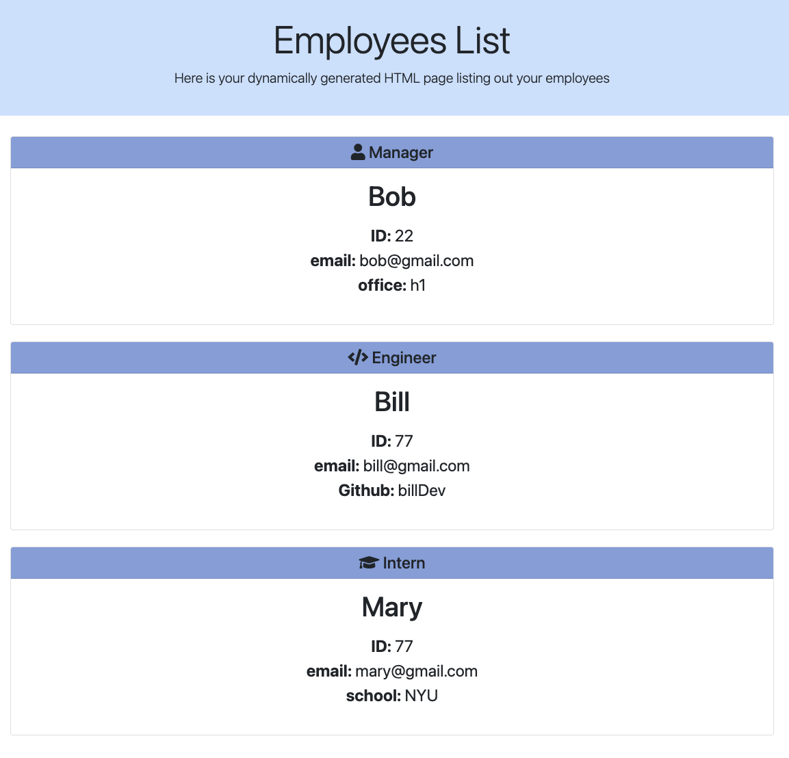

# ReadMe - Challenge 10 📝

## Description 

This is an app designed to take in inputs from a user specifying information about a team of employees and use this information to dynamically generate an HTML page displaying them.  View more info below, as well as a screenshot and demo video of the app in action.  

Video overview: [link here](https://monosnap.com/file/3CsHOiiph2O4J51WQPA7RP2DYrMmd8)

---

## Table of Contents 

* [Descripton](#description)

* [Installation Instructions](#installation-instructions)

* [Usage Information](#usage-information)

* [App License](#app-license)

* [Contribution Guidelines](#contribution-guidelines)

* [Testing Instructions](#testing-instructions)

* [Questions](#questions)

---

## Installation Instructions 

After installing node, simply use "npm install" to install all dependencies in the package.json file, including Inquirer and the Jest testing packet.  To run the application, use "node index.js" in the appropriate folder, or to run tests, use "npm run test" 

---

## Usage Information 

For each of the prompts, provide the relevant information about your team member.  After adding a "manager", you can choose to add "engineers" and/or "interns", or to complete your team.  Once complete, your team will automatcially be rendered into the output.html file 

---

## App License 

This app is covered under the following license: None

---

## Contribution Guidelines 

This app was developed indepentently, though all suggestions are welcome

---

## Testing Instructions 

Use "npm run test" to activate the app's test suite.  Feel free to try finding bugs, although hopefully there shouldn't be any!

---

## Questions 

For more information and questions, please contact me at <bensdecker@gmail.com> or by visiting my [github account](https://github.com/benjiCCB)