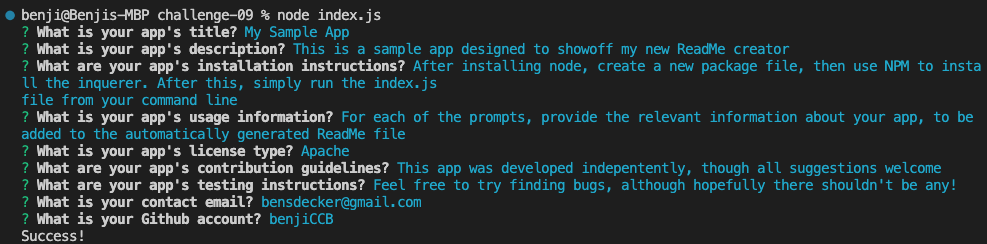

# ReadMe - Challenge 09 📝

## Description 

This is an app designed to automatically generate READMEs based on a series of prompts.  View more info below, as well as a screenshot and demo video of the app in action.  

This readme was generated using the tool!

Video overview: [link here](https://drive.google.com/file/d/1aafC0zu95bp5mlnKHAIptUKuWFew65wv/view)

---

## Table of Contents 

* [Descripton](#description)

* [Installation Instructions](#installation-instructions)

* [Usage Information](#usage-information)

* [App License](#app-license)

* [Contribution Guidelines](#contribution-guidelines)

* [Testing Instructions](#testing-instructions)

* [Questions](#questions)

---

## Installation Instructions 

After installing node, create a new package file, then use NPM to install the 'inquerer' package. After this, simply run the index.js file from your command line

---

## Usage Information 

For each of the prompts, provide the relevant information about your app, to be added to the automatically generated ReadMe file

---

## App License 

This app is covered under the following license: None

---

## Contribution Guidelines 

This app was developed indepentently, though all suggestions are welcome

---

## Testing Instructions 

Feel free to try finding bugs, although hopefully there shouldn't be any!

---

## Questions 

For more information and questions, please contact me at <bensdecker@gmail.com> or by visiting my [github account](https://github.com/benjiCCB)